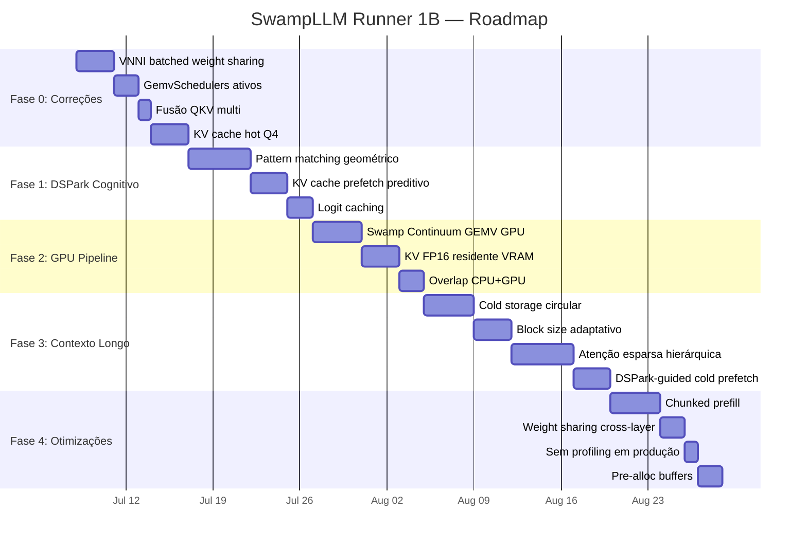

---
tags:
  - swamp
  - roadmap
  - refactoring
  - dspark
created: 2026-07-07
---

# Plano de Refatoração: SwampLLM Runner 1B

**Meta:** 1B parâmetros Q4_K, 5–10M contexto, >150 tk/s no i5-11260H + GTX 1650 4GB

> [!info] Hardware-alvo
> - **CPU:** i5-11260H (Tiger Lake, 6C/12T, AVX-512)
> - **GPU:** GTX 1650 4GB (Turing TU117, sem tensor cores)
> - **RAM:** 24GB DDR4
> - **Storage:** NVMe SSD

---

## Diagnóstico: Por que não alcança hoje

| Problema | Impacto | Causa raiz |
|---|---|---|
| VNNI batched com weight sharing **desligado** | 2–3× mais lento que deveria | `fused_gemv_q4k_batched` chama `single` por token |
| `GemvSchedulers` instanciado mas **nunca usado** | threads fixas ignoram custo real | Ninguém chama `schedule()`/`record()` |
| `forward_linear_multi` executa Q/K/V em **sequência** (3 chamadas separadas) | overhead de rayon dispatch 3× por layer | Fusão real existe (`multi` no kernel) mas não integrada |
| `prefill_batch` aloca `Vec<Vec<f32>>` para batch **inteiro** | OOM em prompts >100K tokens | Falta chunked/sliding window |
| KV cache hot em FP32 | 64 KB/token — só cabe ~375K tokens em 24GB RAM | Sem tier Q4 em páginas quentes |
| DSPark: n-gram puro, draft=target | Ganho zero em texto criativo | Falta padrão cognitivo no embedding space |
| Cold storage: append-only sem GC | Arquivo cresce até encher o disco | Sem circular buffer |
| GPU só faz attention, nunca GEMV | GPU subutilizada (4GB VRAM ociosa) | Swamp Continuum não integrado ao executor |
| `ensure_pages_hot` roda a cada token | I/O síncrono mesmo quando GPU está ativa | Corrigido parcialmente, mas sem prefetch adaptativo |
| `PagedKVCache` com block_size=32 fixo | 5M tokens = 156K páginas → overhead LRU enorme | Block size adaptativo |

---

## Arquitetura Alvo

```
                    ┌─────────────────────────────────────┐
                    │          Fugu Orchestrator           │
                    │  (decide estratégia por step/token)  │
                    └──────────┬──────────────────────────┘
                               │
          ┌────────────────────┼────────────────────┐
          ▼                    ▼                    ▼
  ┌───────────────┐   ┌───────────────┐   ┌───────────────┐
  │ Cognitive     │   │ GEMV Scheduler│   │ Memory Tier   │
  │ DSPark        │   │ (vnpu.rs)     │   │ (cache.rs)    │
  │ (predição     │   │ CPU↔GPU       │   │ VRAM↔RAM↔NVMe │
  │  geométrica)  │   │ online        │   │ + prefetch    │
  └───────────────┘   └───────────────┘   └───────────────┘
```

**Três eixos integrados pelo `FuguOrchestrator`:**
1. **Cognitive DSPark** — prevê tokens e acessos ao KV cache via geometria do embedding
2. **GEMV Scheduler** — decide CPU vs GPU e quantas threads por operação
3. **Memory Tier** — gerencia migração KV cache entre VRAM/RAM/NVMe

---

## Fase 0: Correções Críticas

**Duração:** Semana 1
**Ganho esperado:** ~40% imediato no decode

### 0.1 — Reativar VNNI batched com weight sharing

- **Arquivo:** `swamp-kernels/src/fused_gemv_q4k.rs`
- **Ação:** Debugar e reativar o loop de weight reuse no batched VNNI (linhas comentadas "Weight-sharing optimization disabled")
- **Resultado:** 2–3× no decode (batched GEMM passa a carregar pesos Q4_K uma vez por bloco)
- **Risco:** AVX-512 downclock pode reduzir ganho → manter fallback AVX2 com weight sharing

### 0.2 — Conectar `GemvSchedulers` ao dispatch linear

- **Arquivos:** `swamp-engine/src/vnpu.rs`, `swamp-engine/src/linear.rs`
- **Ação:** `forward_linear_multi` e `forward_linear` consultam `GemvSchedulers::schedule()` e chamam `record()` após execução. Substituir `n_threads` estático por `scheduler.adapt()`
- **Resultado:** 20–30% no decode (número de threads ajusta dinamicamente por grupo GEMV)

### 0.3 — Fusão real de Q/K/V e Gate/Up no GEMV

- **Arquivo:** `swamp-engine/src/linear.rs`
- **Ação:** Integrar `fused_gemv_q4k_multi()` (já existe no kernel) nos paths de `forward_linear_multi` e `forward_gemvs`. Em vez de 3 chamadas rayon separadas, uma única chamada multi-matrix com weight sharing entre Q/K/V
- **Resultado:** Reduz overhead de dispatch de 3× para 1× por grupo de tensores

### 0.4 — KV cache hot em Q4 (não FP32)

- **Arquivo:** `swamp-engine/src/cache.rs`
- **Ação:** Adicionar `PageFormat::Q4` como formato primário de páginas quentes. Manter FP32 apenas para eviction/reload. `k_page_ptr()` e `v_page_ptr()` retornam ponteiros Q4. Atenção CPU com `attention_sparse_q4()` (já existe em `ops.rs`)
- **Resultado:** 8 KB/token em vez de 64 KB → 2M tokens cabem em 16GB RAM (em vez de 250K)

> [!warning] Dependência
> A `attention_sparse_q4()` em `ops.rs` precisa ser validada contra a versão FP32. Pode haver diferenças de perplexity que precisam ser medidas.

---

## Fase 1: DSPark Cognitivo

**Duração:** Semanas 2–3
**Ganho esperado:** 2–4× via especulação inteligente

### 1.1 — Pattern matching no embedding space (substitui n-gram puro)

- **Arquivo:** `swamp-engine/src/dspark.rs` (reescrever)
- **Algoritmo:**
  - Manter índice de **LSH hashes** de janelas de 32 tokens no embedding space
  - Cada janela mapeia para os tokens que a seguem
  - No decode, se o hash atual bate com histórico, os próximos N tokens são prováveis repetições
- **Nova trait:**
  ```rust
  trait DraftEngine {
      fn draft(&mut self, ctx_embeddings: &[f32]) -> Vec<(usize, f32)>;
      fn observe(&mut self, tokens: &[usize], embeddings: &[f32]);
  }
  ```
- Duas implementações: `NgramDraft` (existente, cold start) e `PatternDraft` (novo, embedding-based)

### 1.2 — KV cache pattern prefetch

- Quando `PatternDraft` detecta repetição, sabe exatamente quais blocos do KV cache serão acessados (os mesmos da repetição anterior)
- Disparar `_mm_prefetch` para endereços específicos no cache Q4
- **Resultado:** Prefetch determinístico vs. madvise genérico atual

### 1.3 — Acceptance boosting com cached logits

- Durante verification step, o target model já computa logits para os draft tokens
- Armazenar em cache. Se o mesmo draft token aparecer de novo, pular re-compute
- **Resultado:** 10–20% reduction em compute para tokens repetidos dentro da mesma janela de especulação

> [!note] Métrica de sucesso
> Acceptance rate > 0.6 em texto criativo, > 0.9 em código/estruturado

---

## Fase 2: Pipeline GPU-CPU

**Duração:** Semanas 3–4
**Ganho esperado:** 1.5–2× no decode

### 2.1 — Swamp Continuum no executor (GEMV GPU)

- **Arquivos:** `swamp-engine/src/executor.rs`, `swamp-gpu/src/lib.rs`
- **Ação:** Integrar `gpu_swamp_enqueue()` para dispatcar GEMVs Q4_K dos **primeiros 4 layers** (mais quentes) para GPU. Restante fica na CPU. O kernel persistente `swamp_continuum` já suporta GEMV no CUDA
- `vnpu.rs`: `Backend::Gpu` finalmente acionado quando GPU GEMV está disponível

### 2.2 — KV cache FP16 residente na VRAM (últimos ~500K tokens)

- GPU tem 4GB VRAM → ~550MB para modelo Q4_K + ~500MB para buffers = ~2.9GB livres
- 2.9GB em FP16 = ~740K tokens de KV cache (2KB/token em FP16)
- **Ação:** Manter sliding window dos últimos 500K tokens em FP16 na VRAM. Atenção GPU lê diretamente (`gpu_attention_streamed_half` já implementado)
- Política de migração: LRU entre VRAM FP16 ↔ RAM Q4 ↔ NVMe Q4

### 2.3 — Overlap de pipeline (CPU + GPU concorrentes)

- Enquanto GPU processa attention do layer L, CPU já computa QKV GEMV do layer L+1
- `PipelineToken` (já existe em `scheduler.rs`) estendido para 2 operações in-flight
- Sincronização via `cudaEvent` entre stages

---

## Fase 3: Contexto Longo 5–10M

**Duração:** Mês 2
**Foco:** Viabilizar contexto na escala de milhões de tokens

### 3.1 — Cold storage circular (arquivo de tamanho fixo)

- Substituir append-only por arquivo pré-alocado de N páginas
- Bitmap de blocos livres. `evict()` marca bloco como livre. `reload()` aloca do bitmap.
- GC zero: arquivo nunca cresce além do tamanho configurado

### 3.2 — Block size adaptativo

- `block_size` atual = 32 (fixo). Para 5M tokens: 156K páginas → LRU O(n)
- Novo: block_size dinâmico baseado na distância:
  - Últimos 4K tokens: block_size=32 (granularidade fina)
  - 4K–128K atrás: block_size=128
  - 128K+: block_size=1024 (compressão 32×)
- Hierarquia de LRU por zona de granularidade

### 3.3 — Atenção esparsa hierárquica

- Fugu decide janela: sliding window (4K) + tokens "sentinel" a cada 256 posições + DSPark-selected cold blocks
- `AttentionStrategy` estendido:
  ```rust
  HierarchicalSparse {
      window: usize,         // 4096
      sentinel_stride: usize, // 256
      num_cold_blocks: usize, // selecionados por DSPark
      max_attention_span: usize, // 5M
  }
  ```

### 3.4 — DSPark-guided cold prefetch

- DSPark mantém índice: para cada padrão de embedding atual, quais blocos frios foram acessados nas últimas N ocorrências
- Antes do primeiro acesso a um bloco frio, `io_uring` já está carregando-o para RAM
- Integrar com `PrefetchEngine` (atualmente só para pesos do modelo)

---

## Fase 4: 150+ tok/s

**Duração:** Mês 3
**Foco:** Otimizações finas para atingir a meta de throughput

### 4.1 — Chunked prefill para prompts longos

- `prefill_batch` atual aloca O(batch × embed_dim) → explode com >100K tokens
- Novo: processar em chunks de 4096 tokens, acumulando KV cache incrementalmente
- Paralelizar chunks entre CPU (GEMV) e GPU (attention)

### 4.2 — Weight sharing cross-layer

- Modelos 1B frequentemente compartilham pesos entre layers adjacentes
- Detectar via hash do conteúdo bruto dos tensores. Se layer L e L+1 têm mesmos pesos, processar juntos (uma leitura de RAM, duas saídas)

### 4.3 — Remover profiling em produção

- `ProfileSink` faz 64 atomic CAS por decode step (32 layers × 2)
- Desligar quando `RUST_LOG` não for debug. Ou amostragem 1:1000.

### 4.4 — Pre-alloc de todas as estruturas

- `Vec::new()` a cada token para buffers de layer → custa allocator + page fault
- Substituir por buffers fixos pré-alocados no boot, reutilizados via clear + splice

---

## Roadmap Temporal



---

## Risco Técnico & Mitigação

| Risco | Prob. | Mitigação |
|---|---|---|
| AVX-512 downclock invalida ganho VNNI | Média | `wrmsr 0x1FC 0x4004005f` (documentado em `AGENTS.md`); fallback AVX2 com weight sharing |
| GTX 1650 não tem tensor cores → GEMV GPU lento | Alta | Só offload Q4_K (int8 compute, sem dequant); se não ganhar, fica só attention GPU |
| Pattern matching DSPark não converge para 150 tok/s | Média | Fallback: n-gram clássico + sliding window; pipeline GPU compensa |
| Cold storage Q4 em NVMe + atenção esparsa não escala para 10M | Baixa | Block size adaptativo reduz páginas de 156K para ~5K gerenciáveis |

---

## Métricas de Verificação

| Milestone | Métrica | Critério |
|---|---|---|
| Fase 0 | decode tok/s (128 ctx, Q4_K) | > 80 tok/s CPU-only |
| Fase 1 | acceptance rate DSPark | > 0.6 criativo, > 0.9 código |
| Fase 2 | decode tok/s (GPU+CPU) | > 120 tok/s |
| Fase 3 | contexto máximo sem OOM | > 5M tokens |
| Fase 4 | decode tok/s (5M ctx) | > 150 tok/s |

---

## Arquivos-chave por fase

### Fase 0
- `swamp-kernels/src/fused_gemv_q4k.rs` — reativar VNNI batched
- `swamp-engine/src/vnpu.rs` — conectar schedulers
- `swamp-engine/src/linear.rs` — fusão multi-matrix
- `swamp-engine/src/cache.rs` — hot pages em Q4
- `swamp-engine/src/ops.rs` — validar `attention_sparse_q4`

### Fase 1
- `swamp-engine/src/dspark.rs` — reescrever com PatternDraft
- `swamp-engine/src/fugu.rs` — estender AttentionStrategy
- `swamp-engine/src/prefetch.rs` — estender para KV cache

### Fase 2
- `swamp-gpu/src/lib.rs` — bridge Swamp Continuum
- `swamp-engine/src/executor.rs` — pipeline GPU
- `swamp-engine/src/scheduler.rs` — overlap CPU+GPU
- `swamp-gpu/kernels/fused_attention.cu` — kernel persistente

### Fase 3
- `swamp-engine/src/cache.rs` — circular buffer + block adaptativo
- `swamp-engine/src/ops.rs` — atenção hierárquica
- `swamp-engine/src/fugu.rs` — estratégia cold prefetch

### Fase 4
- `swamp-engine/src/executor.rs` — chunked prefill
- `swamp-engine/src/hlc.rs` — profiling sampling
- `swamp-engine/src/linear.rs` — weight sharing detection

---

## Referências

- [[VNPU_CONCEPT.md]] — Conceito de virtualização de clock/threads/cache/NPU
- `AGENTS.md` — Comandos de build e benchmark
- `swamp-gpu/kernels/fused_attention.cu` — Kernel CUDA Swamp Continuum
- `swamp-engine/src/vnpu.rs` — VirtualNpuScheduler
- `swamp-engine/src/cache.rs` — PagedKVCache
